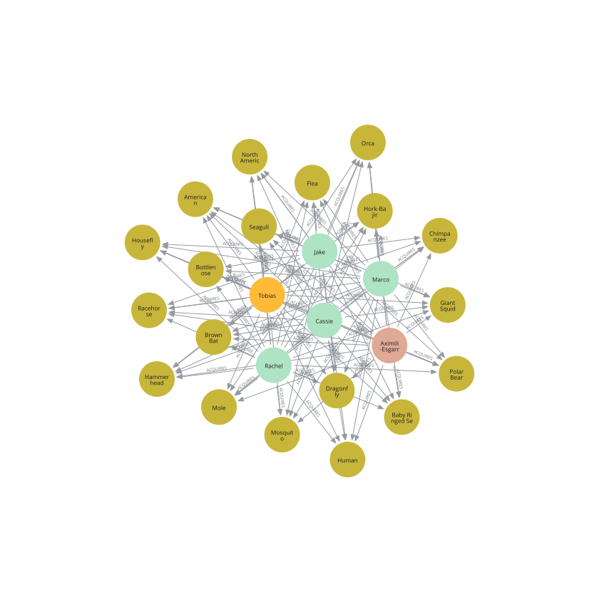
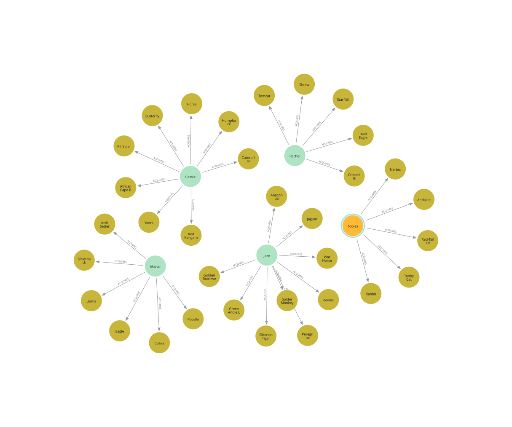

## Animorphs Common vs. Unique Morphs


As a 90s kid, Animorphs was an extremely influential books series that shaped my taste in books. The series focused on a group of teenagers who acquired the power to "morph" into different animals and used their new found power to fight off a secret alien invasion. 

By default, I tend to think of data in terms of structured rows and columns. Does it neatly fit into a spreadsheet? However, in order to expand how I think about data, I want to learn more about graph data models that focuses on understanding and visualizing relationships between nodes, rather than looking up specific values. 

This Neo4j will explore which animal morphs were unique to specific characters vs. shared across the team.


## Tech: 
* Neo4j

## Findings:

What morphs do the Animorphs have in common? 

```cypher
MATCH (animorph)-[:MEMBER_OF]->({name: 'Animorphs'})
WITH collect(animorph) AS members
MATCH (a)
WHERE all(m IN members WHERE (a)<-[:ACQUIRES]-(m))
MATCH q = (a)<-[:ACQUIRES]-()
RETURN q
```


Despite frequently commenting on the ethical challenges in morphing into another human, by the end of the series, everyone on the team has a human morph that isn't them. From a non-earth species perspective, every Animorph also has a Hork-Bajir morph. While each member of the team tends to have their own preferred flying morph (although everyone, including Tobias, has a seagull), there is major aquatic overlap including Bottlenose Dolphin, Orca, Baby Ringed Seal, Hammerhead Shark, and Giant Squid. Additionally, there major insect overlap including Mosquito, Flea, and Dragonfly.    


What are each character's unique morphs?

```cypher
MATCH (animorph)-[:MEMBER_OF]->({name: 'Animorphs'})
WITH collect(animorph) AS members
MATCH (a)<-[:ACQUIRES]-(m)
WHERE m IN members
WITH a, collect(DISTINCT m) AS acquirers
WHERE size(acquirers) = 1
WITH a, acquirers[0] AS soleAcquirer
MATCH p = (a)<-[:ACQUIRES]-(soleAcquirer)
RETURN p
```


Unique morphs fell into a few different flavors. 

1) Pets: Jake morphing into his Golden Retriever or Tobias morphing into his cat
2) Battle Morphs: Jake's unique Siberian Tiger or Marco's Silverback Gorilla
3) Unique Storylines: Rachel has both a Crocodile (which she developed an allergic reaction to) and Starfish where she gets split in two. Cassie has the caterpillar/butterfly combo when she debates quitting the team and is the only Animorph to change into a Yeerk. 

Also of note - poor Ax doesn't have any unique morphs relative to his human team members. And to add insult to injury, Tobias can morph into an Ax. 

## Lessons Learned
* Devil In the *Schema* Details:
	* Setting up the schema was much harder than I anticipated, especially in regards to philosphical organizaitonal questions. For example, Tobias starts off as a human, gets trapped as red-tailed hawk, and then later requires his DNA allowing him morph back to his original form. Under what form should Tobias be recorded as? Unless you are a hard core Animorphs fan, you likely don't know Ax's full name of "Aximili-Esgarrouth-Isthill" of the top of your head. But in the spirit of keeping the nodes clean, I didn't add in aliases or alternative names. 
	* While beyond the scope of this exploration, this would have popped up in some tricky labeling cases. For example, technically, Visser Three is a rank, while the individual that holds the rank is Esplin 9466. But once again, unless you are actively particapting in Animorphs trivia, that's a super deep cut.  
* Use LLMs for Syntax
	* Given my primary EDA tools are combination of SQL and Python, I struggled to fully understand the Cypher syntax. For example, I'm still trying to internalize the core Cypher pattern of "Node - Relationship - Node" across both the selection and conditional parts of the code. However, Claude did a decent job translating natural language questions into a proper Cypher query.

## Roadmap
- [x] Upload proof of concept data schema focusing on morphs
- [x] Create Morph-focused Graphs 
- [x] Record lessons learned
